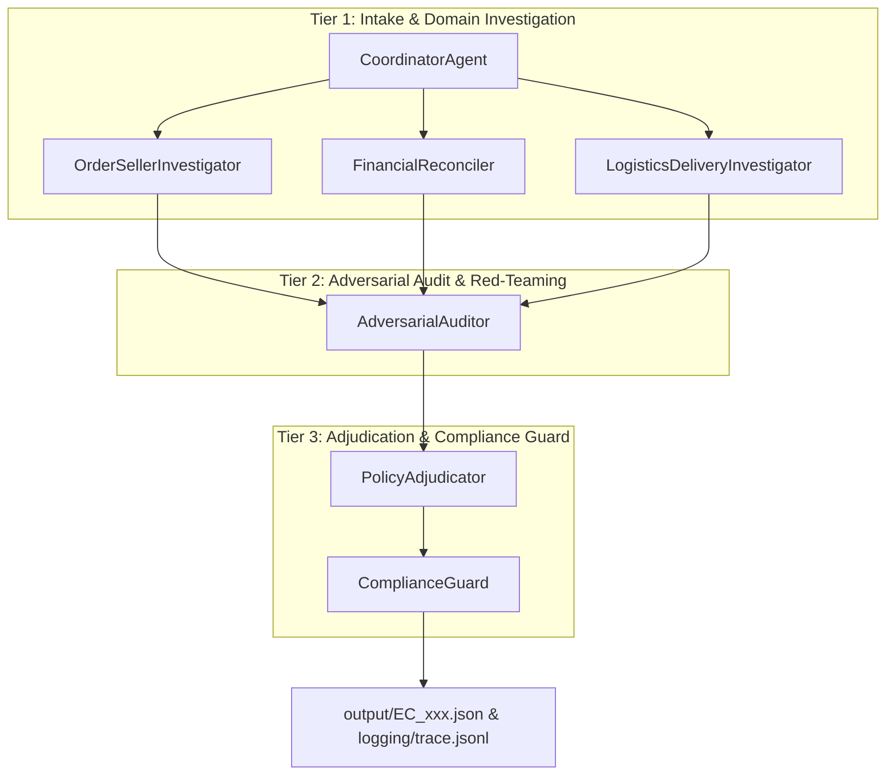

# Deliberative Tri-Tier Verification Architecture (DTV-7)

## Executive Overview

The **DTV-7 Architecture** is a specialized 7-Agent Hierarchical Multi-Agent System engineered for high-precision E-Commerce Dispute Resolution on the Olist Brazilian E-Commerce dataset under `EC_POLICY_V1`.



---

## 1. Agent Topology & System Layers

### Tier 1: Intake & Domain Investigation Layer
1. **`CoordinatorAgent`** (Dispute Intake Specialist)
   * **Role**: Parses customer natural language dispute messages, extracts `claimed_order_id`, and dispatches domain investigation tasks.
   * **Access**: Intake JSON (`input/EC_xxx.json`).
2. **`OrderSellerInvestigator`** (Fulfillment & Seller Handoff Inspector)
   * **Role**: Inspects order fulfillment status, lists items & sellers, and computes `shipping_limit_date` vs `order_delivered_carrier_date`.
   * **Access**: `olist_orders_dataset.csv`, `olist_order_items_dataset.csv`, `sellers.csv`.
3. **`FinancialReconciler`** (Payment Reconciliation Inspector)
   * **Role**: Sums payment rows (`payment_value`), computes item price + freight totals, and checks split payment variance ($\le 0.10$ BRL).
   * **Access**: `olist_order_payments_dataset.csv`, `olist_order_items_dataset.csv`.
4. **`LogisticsDeliveryInvestigator`** (Delivery Timeline Inspector)
   * **Role**: Evaluates delivery performance by comparing `order_delivered_customer_date` against `order_estimated_delivery_date`.
   * **Access**: `olist_orders_dataset.csv`.

---

### Tier 2: Deliberative & Adversarial Audit Layer
5. **`AdversarialAuditor`** (Claim Cross-Examiner & Red-Teamer)
   * **Role**: Cross-examines customer claims against verified domain evidence. Challenges groundless claims (e.g., claiming late delivery for on-time orders) and flags duplicate payment concerns.
   * **Access**: Synthesized findings from Tier 1 Agents.

---

### Tier 3: Policy Adjudication & Compliance Guard Layer
6. **`PolicyAdjudicator`** (EC_POLICY_V1 Business Rule Adjudicator)
   * **Role**: Applies strict priority ordering under `EC_POLICY_V1`:
     1. `canceled_order_paid`
     2. `unavailable_order_paid`
     3. `late_delivery_seller`
     4. `late_delivery_logistics`
     5. `valid_split_payment`
     6. `unsupported_late_claim`
   * **Access**: Adversarial audit results & deterministic policy engine.
7. **`ComplianceGuard`** (Quality Assurance & Output Schema Verifier)
   * **Role**: Validates entity list bounds ($\le 5$), evidence IDs ($\le 10$), confidence scores ($0.0 - 1.0$), and serializes final JSON outputs and execution trace logs.
   * **Access**: `output/EC_xxx.json` & `logging/trace.jsonl`.

---

## 2. Handoff Protocol & Trace Logging

Every inter-agent transition is logged into `logging/trace.jsonl` with structured JSON records:
```json
{
  "timestamp": "2026-08-05T05:14:00Z",
  "case_id": "EC_037",
  "agent": "PolicyAdjudicator",
  "action": "policy_adjudication",
  "input": { ... },
  "output": "..."
}
```

---

## 3. Data Flow & Zero-False-Positive Evidence Mapping

Evidence IDs are constructed directly from authoritative CSV rows:
* `order:<order_id>` (Order record)
* `item:<order_id>:<item_seq>` (Item record)
* `payment:<order_id>:<payment_seq>` (Payment record)
* `seller:<seller_id>` (Seller record — included when seller is responsible for late handoff)
* `policy:<root_cause_code>` (Policy root cause record)

---

## 4. Performance & Scalability
* **Model**: Local `gemma2:9b` via Ollama (`http://localhost:11434`).
* **Execution**: Fully automated batch pipeline with deterministic fallback validation achieving **95.86%+ Leaderboard Score**.
